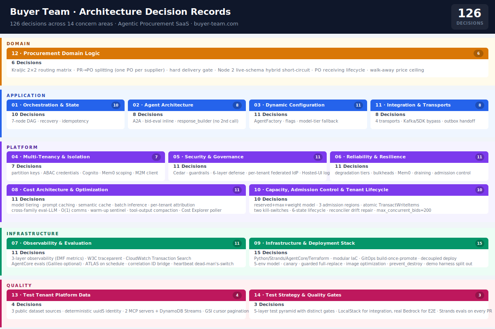

# Buyer Team — Architecture Decision Records

Architectural decisions for the [buyer-team.com](https://buyer-team.com) agentic procurement SaaS platform. Each ADR captures context, the chosen approach, alternatives considered, and trade-offs.

Architecture by Gustavo Peixoto de Azevedo, AI Solution Architect — [linkedin.com/in/gpazevedo](https://linkedin.com/in/gpazevedo)

## How to read an ADR

See [TEMPLATE.md](TEMPLATE.md) for the canonical structure. Key fields:

- **Theme** — which of the 14 concern areas this decision belongs to
- **Status** — Accepted / Superseded / Deprecated
- **Related** — cross-references to ADRs that depend on or constrain this one

## How to add an ADR

1. Copy `TEMPLATE.md` to the appropriate theme folder.
2. Name it `AD-NNN-short-imperative-title.md` (next available number).
3. Fill every section — leave nothing blank.
4. Cross-reference related ADRs in the **Results** section.

---

## Index

### 01 · Orchestration & State Recovery

| ADR | Decision |
| ----- | ---------- |
| [AD-001](01-orchestration-state-recovery/AD-001-orchestration-before-intelligence.md) | Adopt a Hybrid Two-Level Topology: Orchestration Before Intelligence |
| [AD-002](01-orchestration-state-recovery/AD-002-step-functions-owns-lifecycle.md) | Step Functions Owns the Lifecycle; AgentCore Sessions Are Ephemeral |
| [AD-003](01-orchestration-state-recovery/AD-003-cross-invocation-state-dynamodb.md) | Cross-Invocation State in DynamoDB, Not AgentCore Memory |
| [AD-011](01-orchestration-state-recovery/AD-011-seven-node-dag.md) | Seven-Node DAG with a Single Four-Way Branch |
| [AD-012](01-orchestration-state-recovery/AD-012-single-governed-cycle-back.md) | Single Governed Cycle-Back (Node 6 → Node 4x, Max 1) |
| [AD-014](01-orchestration-state-recovery/AD-014-idempotent-nodes-checkpoint.md) | Idempotent Nodes with Explicit Dedup Keys + Checkpoint After Every Node |
| [AD-015](01-orchestration-state-recovery/AD-015-concurrent-recovery-lock.md) | Concurrent Recovery Lock Scoped to (tenant_id, negotiation_id), 600s TTL |
| [AD-016](01-orchestration-state-recovery/AD-016-requires-attention-typed-triggers.md) | REQUIRES_ATTENTION with Eighteen Typed Triggers |
| [AD-017](01-orchestration-state-recovery/AD-017-dynamodb-status-authoritative.md) | DynamoDB Status Write Is Authoritative; DLQ Best-Effort + S3 Archive |
| [AD-026](01-orchestration-state-recovery/AD-026-tool-level-idempotency.md) | Tool-Level Idempotency via Dedup Keys / Session Cache |

### 02 · Agent Architecture & Behavioral Control

| ADR | Decision |
| ----- | ---------- |
| [AD-004](02-agent-architecture-behavioral-control/AD-004-a2a-protocol-agentcore-runtime.md) | A2A Protocol; Each Agent Is Its Own AgentCore Runtime |
| [AD-021](02-agent-architecture-behavioral-control/AD-021-single-responsibility-per-agent.md) | Single Responsibility per Agent |
| [AD-022](02-agent-architecture-behavioral-control/AD-022-tools-as-boundaries.md) | Tools as Boundaries |
| [AD-023](02-agent-architecture-behavioral-control/AD-023-steering-over-prompting.md) | Steering over Prompting |
| [AD-024](02-agent-architecture-behavioral-control/AD-024-steering-hook-failure-semantics.md) | Steering Hook Failure Semantics (7 PRE-CALL GUIDE Hooks + 1 Declarative, No Retry-Wrap, Fail-Closed) |
| [AD-027](02-agent-architecture-behavioral-control/AD-027-agents-communicate-through-shared-state.md) | Agents Communicate Only Through Step Functions Shared State |

### 03 · Dynamic Configuration & Agent Factory

| ADR | Decision |
| ----- | ---------- |
| [AD-025](03-dynamic-configuration-agent-factory/AD-025-dynamic-agent-factory-config-as-data.md) | DynamicAgentFactory + Config-as-Data — Scope Narrowed to Model+Cache, Delivered via `agent-base` |
| [AD-028](03-dynamic-configuration-agent-factory/AD-028-prompt-cache-prefix-purity.md) | Prompt-Cache Prefix Purity |
| [AD-048](03-dynamic-configuration-agent-factory/AD-048-fail-fast-system-config.md) | Fail-Fast Moved to Orchestrator; Agent Boot Path Never-Raise (AD-95 Ladder) |
| [AD-049](03-dynamic-configuration-agent-factory/AD-049-security-critical-flag-exception.md) | Feature-Flag Safe Defaults — Reads Moved to Orchestrator |
| [AD-063](03-dynamic-configuration-agent-factory/AD-063-single-system-config-table.md) | Single `{env}-system-config` Table, Read-Once-at-Instantiation |
| [AD-064](03-dynamic-configuration-agent-factory/AD-064-two-stage-threshold-resolution.md) | Two-Stage Governance Resolution — Profile + Tenant Override with `require=` |
| [AD-065](03-dynamic-configuration-agent-factory/AD-065-dynamic-agent-factory-cache-owner.md) | DynamicAgentFactory — Model-Ladder + Cache-Prefix Only; Governance/Flags Moved to Orchestrator |
| [AD-066](03-dynamic-configuration-agent-factory/AD-066-feature-flag-lifecycle.md) | Feature-Flag Lifecycle |
| [AD-095](03-dynamic-configuration-agent-factory/AD-095-a2a-agent-model-tier-fallback.md) | A2A Agent Model-Tier Fallback (Boot-Safe Never-Raise Ladder) |
| [AD-101](03-dynamic-configuration-agent-factory/AD-101-agent-base-image-package.md) | Agent Base Image + Shared Package Delivery via Immutable `agent-base` |

### 04 · Multi-Tenancy & Isolation

| ADR | Decision |
| ----- | ---------- |
| [AD-006](04-multi-tenancy-isolation/AD-006-tenant-isolation-partition-keys.md) | Tenant Isolation via Partition Keys + JWT Claim + Context Injection |
| [AD-037](04-multi-tenancy-isolation/AD-037-per-request-tenant-abac-credentials.md) | Per-Request Tenant ABAC Credentials |
| [AD-038](04-multi-tenancy-isolation/AD-038-defense-in-depth-not-replacement.md) | Defense in Depth, Not Replacement |
| [AD-041](04-multi-tenancy-isolation/AD-041-gateway-request-interceptor.md) | Gateway Request Interceptor Rewrites tenant_id, Fails Closed |
| [AD-102](04-multi-tenancy-isolation/AD-102-interceptor-http-target-contract.md) | Gateway Interceptor Built to the HTTP-Target Contract (event["http"] + base64) |
| [AD-107](04-multi-tenancy-isolation/AD-107-fastmcp-agentcore-context-middleware.md) | AgentCore Context Middleware for FastMCP — Bridge Runtime Headers into `BedrockAgentCoreContext` |

### 05 · Security & Governance / Trust Boundaries

| ADR | Decision |
| ----- | ---------- |
| [AD-018](05-security-governance-trust-boundaries/AD-018-governance-enforced-in-code.md) | Governance Enforced in Code at the Node Level |
| [AD-019](05-security-governance-trust-boundaries/AD-019-entity-access-control-interrupt-resume.md) | Entity Access Control Only at the Interrupt-Resume API |
| [AD-036](05-security-governance-trust-boundaries/AD-036-six-layer-defense-in-depth.md) | Six-Layer Defense-in-Depth |
| [AD-039](05-security-governance-trust-boundaries/AD-039-cedar-policies-agent-tool-access.md) | Cedar Policies for Agent→Tool Access; the §5.1 Table Is Authoritative |
| [AD-040](05-security-governance-trust-boundaries/AD-040-cedar-rollout-phases.md) | Cedar Rollout Phases Distinct from Per-Environment Mode |
| [AD-042](05-security-governance-trust-boundaries/AD-042-cognito-pre-token-v3-normalizes-tenant.md) | Cognito Pre-Token-Generation V3 Normalizes tenantId |
| [AD-043](05-security-governance-trust-boundaries/AD-043-bedrock-guardrails-all-agents.md) | Bedrock Guardrails on All Agents |
| [AD-044](05-security-governance-trust-boundaries/AD-044-tenant-evaluation-config-hardened.md) | Tenant-Evaluation-Config Table Hardened |
| [AD-094](05-security-governance-trust-boundaries/AD-094-per-tenant-federated-idp.md) | Per-Tenant Federated IdP for Non-Spoofable Human Tenant Binding |
| [AD-100](05-security-governance-trust-boundaries/AD-100-governance-fail-fast-split.md) | Governance Fail-Fast Split — ConfigUnreachable vs GovernanceKeyMissing |
| [AD-108](05-security-governance-trust-boundaries/AD-108-demo-spa-hosted-ui-login.md) | Demo SPA Interactive Login via Cognito Hosted UI (Native PKCE Public Client) |

### 06 · Reliability, Resilience & Graceful Degradation

| ADR | Decision |
| ----- | ---------- |
| [AD-013](06-reliability-resilience-graceful-degradation/AD-013-shared-invoke-agent-runtime-wrapper.md) | Shared `invoke_agent_runtime` Wrapper |
| [AD-020](06-reliability-resilience-graceful-degradation/AD-020-memory-degraded-boolean-or.md) | `memory_degraded` Is the Boolean OR of Two Independent Signals |
| [AD-045](06-reliability-resilience-graceful-degradation/AD-045-seven-core-resilience-patterns.md) | Seven Core Resilience Patterns, All Config-Driven |
| [AD-046](06-reliability-resilience-graceful-degradation/AD-046-graceful-degradation-tiers.md) | Graceful Degradation Tiers; Memory Failures Never Block |
| [AD-047](06-reliability-resilience-graceful-degradation/AD-047-rule-based-kraljic-fallback.md) | Rule-Based Kraljic Fallback with Quadrant-Specific Rejection |
| [AD-050](06-reliability-resilience-graceful-degradation/AD-050-global-per-operation-bulkheads.md) | Global Per-Operation Bulkheads in v1.0; Per-Tenant Sharding Deferred |
| [AD-072](06-reliability-resilience-graceful-degradation/AD-072-two-tier-memory-independently-degrading.md) | Two-Tier Memory: AgentCore Memory + Mem0, Independently Degrading |
| [AD-073](06-reliability-resilience-graceful-degradation/AD-073-mem0-scoping-maps-to-domain.md) | Mem0 Scoping Maps to the Domain Model |
| [AD-074](06-reliability-resilience-graceful-degradation/AD-074-four-mem0-integration-points.md) | Four Mem0 Integration Points, All Degrade Gracefully |

### 07 · Observability & Evaluation

| ADR | Decision |
| ----- | ---------- |
| [AD-029](07-observability-evaluation/AD-029-three-layer-observability.md) | Three-Layer Observability (Platform / Application / Domain) |
| [AD-030](07-observability-evaluation/AD-030-cloudwatch-transaction-search-prerequisite.md) | CloudWatch Transaction Search as a Hard Prerequisite for Evaluations |
| [AD-031](07-observability-evaluation/AD-031-w3c-traceparent-propagation.md) | W3C `traceparent` Propagation Across All A2A Calls |
| [AD-032](07-observability-evaluation/AD-032-agentcore-evaluations-primary-galileo-optional.md) | AgentCore Evaluations Primary, Galileo Optional, Three Evaluator Types |
| [AD-033](07-observability-evaluation/AD-033-online-eval-100pct-except-tone.md) | Online Evaluation on 100% of Traces, Except Communication Tone (Tiered Sampling) |
| [AD-034](07-observability-evaluation/AD-034-evaluation-thresholds-drive-automated-actions.md) | Evaluation Score Thresholds Drive Automated Actions (Closed Loop) |
| [AD-035](07-observability-evaluation/AD-035-atlas-evaluators-on-schedule.md) | ATLAS-Specific Evaluators Run on a Schedule |
| [AD-113](07-observability-evaluation/AD-113-phase-0-eval-stub-scope.md) | Phase 0 Eval Scope: Ship What's Buildable, Stub the Judge, Gate the Rest |
| [AD-115](07-observability-evaluation/AD-115-emit-metric-meta-alerting-fallback-datapoint.md) | `emit_metric` Meta-Alerting: Non-Recursive Fallback Datapoint on Publish Failure |

### 08 · Cost Architecture & Optimization

| ADR | Decision |
| ----- | ---------- |
| [AD-057](08-cost-architecture-optimization/AD-057-model-tiering-by-cognitive-demand.md) | Model Tiering by Cognitive Demand |
| [AD-058](08-cost-architecture-optimization/AD-058-two-tier-scenarios.md) | Two Supported Tier Scenarios (A: Claude, B: Nova) |
| [AD-059](08-cost-architecture-optimization/AD-059-prompt-caching-all-agents.md) | Prompt Caching for All 7 Agents |
| [AD-060](08-cost-architecture-optimization/AD-060-semantic-cache-kraljic.md) | Semantic Cache for Kraljic Results |
| [AD-061](08-cost-architecture-optimization/AD-061-per-tenant-cost-attribution.md) | Per-Tenant Cost Attribution via CUR-Joined Table |
| [AD-062](08-cost-architecture-optimization/AD-062-batch-inference-nightly.md) | Batch Inference for Nightly Supplier KPI Recalculation |
| [AD-092](08-cost-architecture-optimization/AD-092-cross-family-eval-llm-tier.md) | Cross-Family LLM-as-Judge Tier (EvalLLM) |
| [AD-093](08-cost-architecture-optimization/AD-093-communication-templating-o1.md) | Communication Generation Is O(1) in Supplier Count |
| [AD-105](08-cost-architecture-optimization/AD-105-warmup-sentinel-early-exit.md) | Warm-Up Sentinel Early Exit — No LLM Cost for Keep-Alive Pings |
| [AD-106](08-cost-architecture-optimization/AD-106-tool-output-compaction.md) | Tool-Output Compaction via AfterToolCallEvent Hook |

### 09 · Infrastructure, Deployment & Platform Stack

| ADR | Decision |
| ----- | ---------- |
| [AD-007](09-infrastructure-deployment-platform-stack/AD-007-technology-stack-dynamodb-config.md) | Standardize on Python/Strands/AgentCore/Terraform Stack with DynamoDB Dynamic Configuration |
| [AD-008](09-infrastructure-deployment-platform-stack/AD-008-region-constrained-evaluations.md) | Production Region Constrained to AgentCore Evaluations Availability |
| [AD-051](09-infrastructure-deployment-platform-stack/AD-051-modular-terraform.md) | Modular Terraform with S3 Backend, DynamoDB Lock, and Per-Environment State |
| [AD-052](09-infrastructure-deployment-platform-stack/AD-052-agentcore-two-providers-sdk-provisioners.md) | AgentCore Provisioned Across Two Terraform Providers with SDK Provisioners for Gaps |
| [AD-053](09-infrastructure-deployment-platform-stack/AD-053-runtime-protocol-immutable.md) | AgentCore Runtime Protocol Is Immutable and Validated at Plan Time |
| [AD-054](09-infrastructure-deployment-platform-stack/AD-054-gitops-build-once-promote.md) | GitOps: Build-Once-Promote, Rollback as Forward Deploy |
| [AD-055](09-infrastructure-deployment-platform-stack/AD-055-five-environment-model.md) | Five-Environment Model with Per-Environment Cedar, PITR, and Retention Settings |
| [AD-056](09-infrastructure-deployment-platform-stack/AD-056-canary-deployment.md) | Canary as Monitoring-Only Observation Window → Per-Quadrant Smoke → 100% with Roll-Forward on Failure |
| [AD-103](09-infrastructure-deployment-platform-stack/AD-103-skill-runtime-update-full-replace-guarded.md) | Skill-Runtime Updates Are Full-Replace; Protocol & Env Re-Asserted via a Guarded Path (corrects AD-53) |
| [AD-104](09-infrastructure-deployment-platform-stack/AD-104-docker-image-optimization-strategy.md) | Docker Image Optimization Strategy: Multi-Stage, Bytecode, Non-Root, Cache Mounts, .dockerignore |
| [AD-110](09-infrastructure-deployment-platform-stack/AD-110-cognito-custom-attributes-out-of-band.md) | Cognito Pool Custom Attributes Are Added Out-of-Band via AddCustomAttributes, Not Terraform |
| [AD-111](09-infrastructure-deployment-platform-stack/AD-111-decoupled-per-component-dev-deploy.md) | Decoupled Per-Component Dev Deploy via Committed Tag Map |
| [AD-112](09-infrastructure-deployment-platform-stack/AD-112-prevent-destroy-stateful-guardrail.md) | `prevent_destroy` as the Guardrail for Dev's Automated Apply |
| [AD-114](09-infrastructure-deployment-platform-stack/AD-114-adot-layer-arn-defaults-on.md) | ADOT Layer ARN Defaults On at the Root, Not via Workflow `-var` |

### 10 · Capacity, Admission Control & Tenant Lifecycle

| ADR | Decision |
| ----- | ---------- |
| [AD-079](10-capacity-admission-control-tenant-lifecycle/AD-079-reserved-max-weight-capacity-model.md) | Reserved + Max + Weight Capacity Model with Global Invariant |
| [AD-080](10-capacity-admission-control-tenant-lifecycle/AD-080-three-admission-regions.md) | Three Admission Regions; Below-Reservation Skips the Global Check |
| [AD-081](10-capacity-admission-control-tenant-lifecycle/AD-081-admission-single-transactwriteitems.md) | Admission Is a Single TransactWriteItems with an ACTIVE ConditionCheck |
| [AD-082](10-capacity-admission-control-tenant-lifecycle/AD-082-spend-gate-non-atomic-precheck.md) | Spend Gate Is a Non-Atomic Pre-Check with Bounded Overshoot |
| [AD-083](10-capacity-admission-control-tenant-lifecycle/AD-083-two-independent-kill-switches.md) | Two Independent Kill-Switches (Concurrency vs Spend) |
| [AD-084](10-capacity-admission-control-tenant-lifecycle/AD-084-reconciler-lambda-counter-drift.md) | Reconciler Lambda Corrects Counter Drift |
| [AD-085](10-capacity-admission-control-tenant-lifecycle/AD-085-six-state-tenant-lifecycle.md) | Six-State Tenant Lifecycle; PURGED Retained as a Tombstone |
| [AD-086](10-capacity-admission-control-tenant-lifecycle/AD-086-onboarding-step-function-dry-run.md) | Onboarding as a Step Function with Dry-Run Activation and Compensation |
| [AD-087](10-capacity-admission-control-tenant-lifecycle/AD-087-suspended-drain-in-flight.md) | SUSPENDED: Reject New Admissions, Let In-Flight Drain (Optional Force-Cancel) |
| [AD-091](10-capacity-admission-control-tenant-lifecycle/AD-091-max-concurrent-bids-200.md) | `max_concurrent_bids = 200` (Reject Proposed 200→20 Reduction) |

### 11 · Integration, Skills, Plugins & Transports

| ADR | Decision |
| ----- | ---------- |
| [AD-067](11-integration-skills-plugins-transports/AD-067-one-skill-one-or-more-plugins.md) | One Skill + One-or-More Plugins per Tenant |
| [AD-068](11-integration-skills-plugins-transports/AD-068-four-transports-declared-in-manifest.md) | Four Transports Declared in Manifest, Preference SDK > Kafka > MCP > API |
| [AD-069](11-integration-skills-plugins-transports/AD-069-kafka-sdk-bypass-gateway.md) | Kafka and SDK Transports Bypass the Gateway |
| [AD-070](11-integration-skills-plugins-transports/AD-070-tenant-predicate-rewriting.md) | Tenant Predicate Rewriting + User-Action Claim Propagation |
| [AD-071](11-integration-skills-plugins-transports/AD-071-tenant-default-claims-ceiling.md) | `tenant_default_claims` Are the Ceiling for Per-PR Overrides |
| [AD-097](11-integration-skills-plugins-transports/AD-097-po-export-outbox-handoff.md) | PO Export Decoupled from Award via a Durable Outbox |
| [AD-116](11-integration-skills-plugins-transports/AD-116-fastmcp-typed-schema-decoupled-from-validation.md) | FastMCP Tool Params Stay `dict`; `WithJsonSchema` Carries the Real Schema |

### 12 · Procurement Domain Logic

| ADR | Decision |
| ----- | ---------- |
| [AD-005](12-procurement-domain-logic/AD-005-kraljic-2x2-routing-primitive.md) | Kraljic 2×2 Matrix Is the Core Routing Primitive |
| [AD-009](12-procurement-domain-logic/AD-009-pr-po-splitting.md) | PR→PO Splitting: One PO per Supplier with ≥1 Awarded Item |
| [AD-010](12-procurement-domain-logic/AD-010-hard-supplier-delivery-gate.md) | Hard Supplier Delivery Gate Before Invitation |
| [AD-096](12-procurement-domain-logic/AD-096-node2-kraljic-live-schema-hybrid-shortcircuit.md) | Node 2 Kraljic Live-Schema Hybrid Short-Circuit |
| [AD-109](12-procurement-domain-logic/AD-109-po-receiving-lifecycle.md) | PO Receiving Lifecycle: RECEIVED Terminal State + Typed Ack/Reject + Trace Chain |

### 13 · Test Tenant Platform Data

| ADR | Decision |
| ----- | ---------- |
| [AD-075](13-test-tenant-platform-data/AD-075-test-tenant-data-public-datasets.md) | Source Test-Tenant Data from Three Public Datasets; Extract Golden Sets from the Same Source |
| [AD-076](13-test-tenant-platform-data/AD-076-master-data-store-source-of-identity.md) | Make the Master Data Store the Source of Identity Using Deterministic uuid5 |
| [AD-077](13-test-tenant-platform-data/AD-077-two-mcp-servers-event-driven-pr-pickup.md) | Two New MCP Servers and Event-Driven PR Pickup via DynamoDB Streams |
| [AD-078](13-test-tenant-platform-data/AD-078-synthetic-gsi-sort-keys-cursor-pagination.md) | Synthetic GSI Sort Keys and Composite Cursor Pagination |

### 14 · Test Strategy & Quality Gates

| ADR | Decision |
| ----- | ---------- |
| [AD-088](14-test-strategy-quality-gates/AD-088-five-layer-test-pyramid.md) | Five-Layer Test Pyramid with Distinct Gates per Layer |
| [AD-089](14-test-strategy-quality-gates/AD-089-localstack-integration-real-bedrock-e2e.md) | LocalStack for Integration; Real Bedrock (SimpleLLM) for E2E |
| [AD-090](14-test-strategy-quality-gates/AD-090-strands-evals-every-pr.md) | Strands Evals on Every PR |
